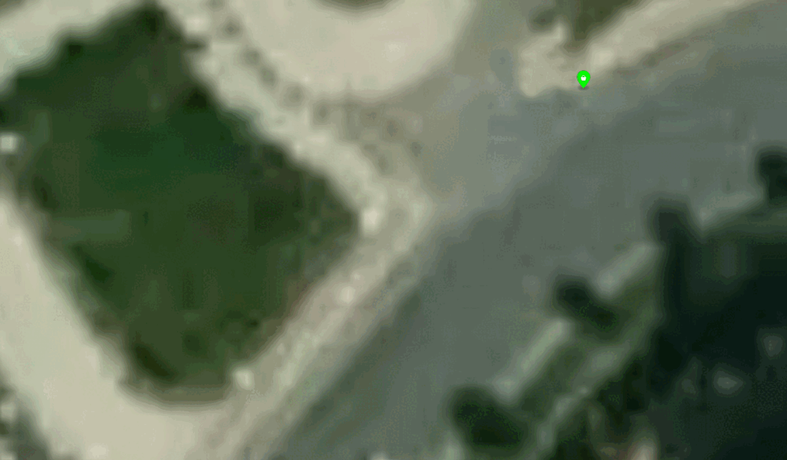

# Object Locazitaion Hackathon

Visiosoft Nesne Konumlandırma Hackathonuna hoşgeldiniz!
Hackathonumuzun amacı; yapay zeka tarafından farklı noktalardan tespit edilen objelerin haritada konumlandırılması.
- Verisetimizde bir çok noktadan 3 farklı cihazla çekilmiş objelerin boundry boxları, idleri ve fotoğrafların çekildiği konum (enlem, boylam) bilgileri yer almaktadır.
- Sizden istediğimiz fotoğrafların konumlarını kullanarak iki veya daha fazla noktadan tespit eidlmiş objelerin haritadaki konumlanırı fotogmetrik yöntemler kullanarak tespit etmeniz.
- Burada örnek bir script ile versietimiz nasıl kullanılacağını görecek ve verisetimiz hakkında bilgi sahibi olacaksınız.

[Buradan](https://colab.research.google.com/drive/1lPtcpxvkrnbfRHF7Rpc4F9fxCpNIM0q8#scrollTo=UdjJfV7BD2CT) Google Colabrotry'e erişim sağlayabilirsiniz.

